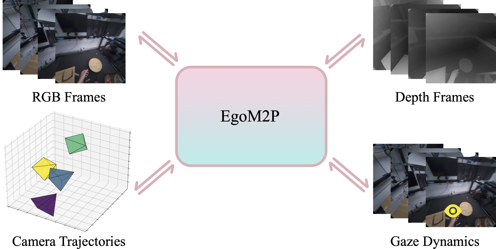

# <p align="center">EgoM2P: Egocentric Multimodal Multitask Pretraining </p>

####  <p align="center"> [Gen Li](https://vlg.inf.ethz.ch/team/Gen-Li.html), [Yutong Chen](https://vlg.inf.ethz.ch/team/Yutong-Chen.html), [Yiqian Wu](https://onethousandwu.com/), [Kaifeng Zhao](https://vlg.inf.ethz.ch/team/Kaifeng-Zhao.html), [Marc Pollefeys](https://people.inf.ethz.ch/marc.pollefeys/), [Siyu Tang](https://vlg.inf.ethz.ch/team/Prof-Dr-Siyu-Tang.html)</p>

### <p align="center">[ArXiv](http://arxiv.org/abs/2506.07886) | [Project Page](https://egom2p.github.io/)

<p align="center">
  
</p><p align="center">
  <b>EgoM2P</b>: A large-scale egocentric multimodal and multitask model, pretrained on eight extensive egocentric datasets. It incorporates four modalities—RGB and depth video, gaze dynamics, and camera trajectories—to handle challenging tasks like monocular egocentric depth estimation, camera tracking, gaze estimation, and conditional egocentric video synthesis. For simplicity, we only visualize four frames here.
</p>

## Code will be released soon


## Citation
```
@article{li2025egom2p,
    title={EgoM2P: Egocentric Multimodal Multitask Pretraining},
    author={Li, Gen and Chen, Yutong and Wu, Yiqian and Zhao, Kaifeng and Pollefeys, Marc and Tang, Siyu},
    journal={arXiv preprint arXiv:2506.07886},
    year={2025}
  }
```
